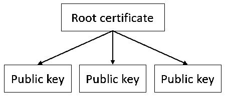
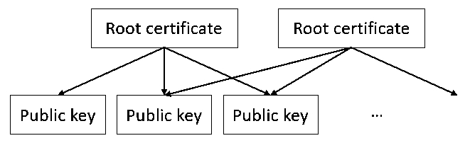
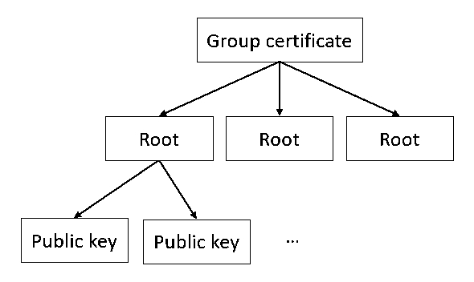
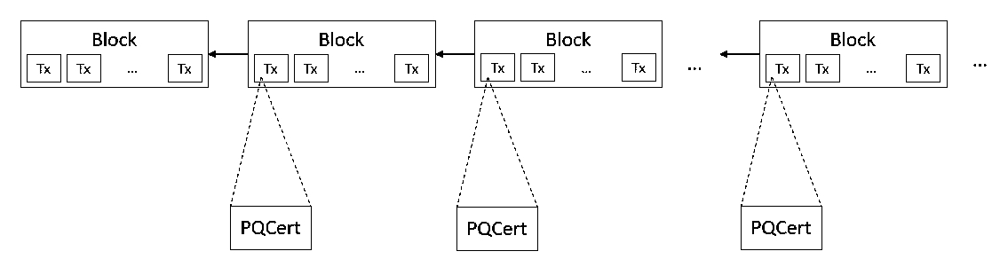
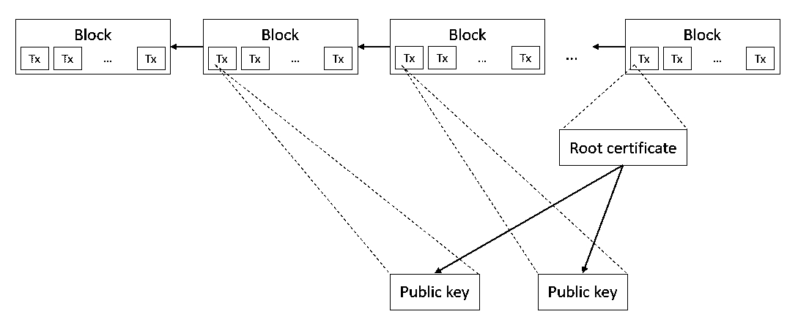

# PQCert
PQCert is a decentralized certificate system named Post-Quantum Certificate.

All transactions on the AEGIS blockchain will be verified through this system. Please refer to ["PQCert_Unlock_Script_Step.md"](PQCert_Unlock_Script_Step.md) for verification process

## PQCert currently includes three types of certificates.
1. Root certificate. **(The hash value of the root certificate is the address)**
2. Public key certificate.
3. Group certificate. **(The hash value of the group certificate is the group address)**

### The PQCert structure of AEGIS is as follows:
- version: 4 byte
- pqcert_type: 1 byte
    ...

**Subsequent structure varies by pqcert_type**

### If the PQCert_type is 0 and goes to the `root certificate`, then the structure is as follows::
- version: 4 byte
- pqcert_type: 1 byte = 0
- level: 1 byte (2-255 Not to exceed the `pubkey_hash_amount`) 
- pubkey_hash_amount: 1 byte (3-255)
- pubkey_hashe: 32 bytes * pubkey_hash_amount
total size: (7 + 32 * pubkey_hash_amount) byte

### JSON format:
```
{
    hash: Buffer,
    version: <uint32>,
    pqcert_type: 0,
    level: <uint8>,
    pubkey_hashes: Buffer[]
}
```

### If the pqcert_type is 1 and goes to the `public key certificate`, then the structure is as follows:
- version: 4 byte
- pqcert_type: 1 byte = 1
- sign_type: 2 byte
- keylen: 4 bytes (uint32)
- pubkey: keylen byte
total size: (11 + keylen) byte

JSON format:
```
{
    hash: Buffer,
    version: <uint32>,
    pqcert_type: 1,
    sign_type: <uint16>,
    keylen: <uint32>,
    pubkey: Buffer
}
```

### If the pqcert_type is 2 and goes to the `Group certificate`, then the structure is as follows:
- version: 4 byte
- pqcert_type: 1 byte = 0
- level: 1 byte (2-255 Not to exceed the `member_amount`) 
- member_amount: 1 byte (2-255)
- member_address_lockTime: (32 + 4 byte) * `member_amount` (32 bytes for member address, 4 bytes for lock time)
total size: (7 + 36 * pubkey_hash_amount) byte

JSON format:
```
{
    hash: Buffer,
    version: <uint32>,
    pqcert_type: 0,
    member_amount: <uint8>,
    member_address_lockTime: { 

        address: Buffer,
        lockTime: uint32
    }
}
```

## The framework diagram of the practical application of the PQCert

### Root certificate.


### The public key certificate can not only belong to a root certificate.


### Group certificate.



## How does the PQCert work?
### In fact, various types of certificates are usually distributed in different block transactions and the required certificate information will be queried in the blockchain during the authentication process based on the hash value of the certificate.


### PQCert correlation example.



