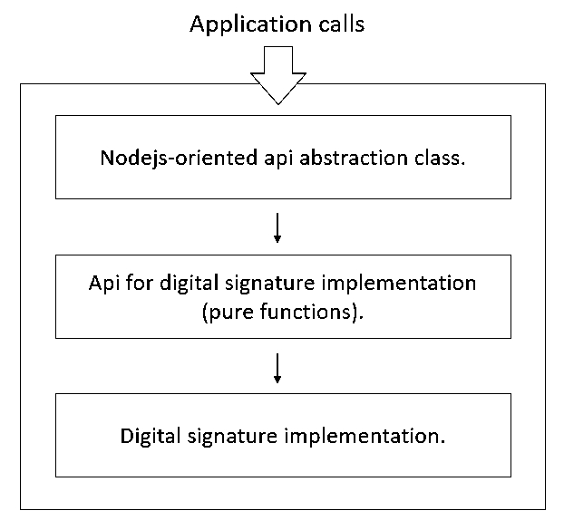

Design
=======
This is an abstract interface for digital signature implementations, with the purpose of unifying the APIs for digital signatures of different algorithms.

The AEGIS signature system has three main components:
------
1. Nodejs-oriented api abstraction class.
2. Api for digital signature implementation (pure functions).
3. Digital signature implementation.

The specification of the implementation API of the digital signature system is as follows:
-------
- genkeyBySeed: (publicKey: Buffer, privateKey: Buffer, seed: Buffer) => boolean
- genSkBySeed: (privateKey: Buffer, seed: Buffer) => boolean
- genPkBySeed: (privateKey: Buffer, seed: Buffer) => boolean
- sign: (signature: Buffer, data: Buffer, sk: Buffer) => boolean
- signBySeed: (signature: Buffer, data: Buffer, seed: Buffer) => boolean
- verifySign: (signature: Buffer, data: Buffer, publicKey: Buffer) => boolean
- getSkLength: () => number
- getPkLength: () => number
- getSignLength: () => number
- getNonceLength: () => number
- getSeedLength: () => number

**The implementation code is not only javascript, but also C++ addons or webasm, you can refer to our secp256k1 and falcon implementation code.**

### `static get signCore()`
Get signature core API

### `static get privateKeySize(): number`
Get private key size.

### `static get signatureSize(): number`
Get signature size.

### `static get seedSize(): number`
Get random seed length of key.

### `static get signSysName(): string`
Get signature system name.

### `static set signSysName(x: string): void`
Set signature system name.

### `static set signCore(x: coreApiType): void`
Set signature core API

### `static genkey(publicKey: Buffer, privateKey: Buffer, seed: Buffer): boolean`
Key generation.

### `static verify(signature: Buffer, data: Buffer, publicKey: Buffer): boolean`
Signatures using public key verification messages.

### `static sign(data: Buffer, privateKey: Buffer): Buffer | false`
Sign the message using the private key.

### `construcor(privateKey: Buffer, publicKey: Buffer, encryptedPrivateKeyMode: boolean = false)`
Instantiate the signature system and set the public and private keys as members.
If encryptedPrivateKeyMode is true, then the private key will be stored using AES256-GCM encryption.

### `sign(data: Buffer, aesKey?: Buffer): false | Buffer`
Sign the message by using the private key in the instantiated number.
If encryptedPrivateKey mode is enabled, then aesKey will be the decryption key of the private key.

### `verify(signature: Buffer, data: Buffer): boolean`
Sign the message using the private key in the instantiated member.

